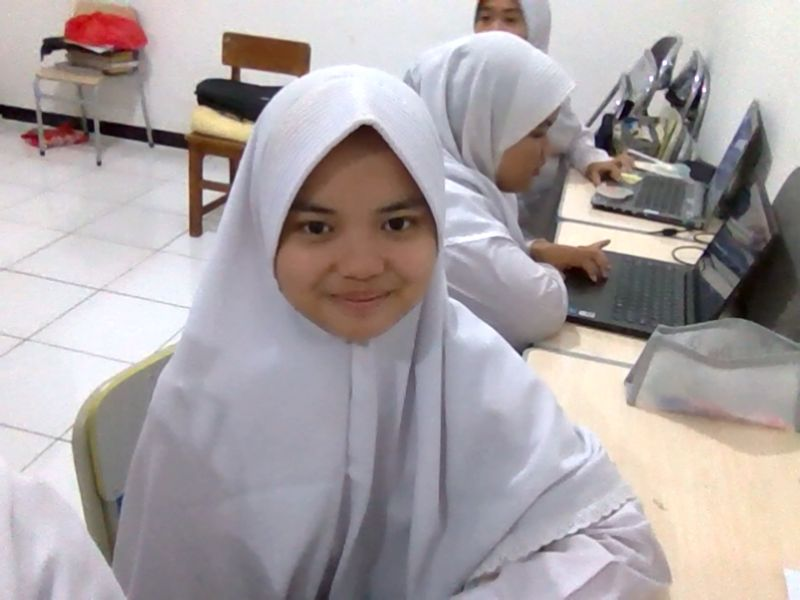

<!-- 🌸 GitHub Profile by ChatGPT -->

<h1 align="center">Hi there 👋, I'm Difa</h1>
<h3 align="center">💡 A curious soul who loves reading, learning new things, and swimming 🏊‍♀️</h3>

---

  

---

## ✨ About Me
- 🎨 Interests: **Web Design | App Design | Conflict Mediation | UI/UX | E-learning | Travelling**
- 📖 Passionate about **reading & discovering new knowledge**
- 🏊 Love swimming to refresh my mind & body
- 🤝 Open to collaboration and new friendships

---

## 🌐 Connect with Me

  

---

## ⚡ GitHub Stats & Activity

  
  

  

---

## 👀 Profile Visitors

  

---

## 🐍 Fun Animation

  

